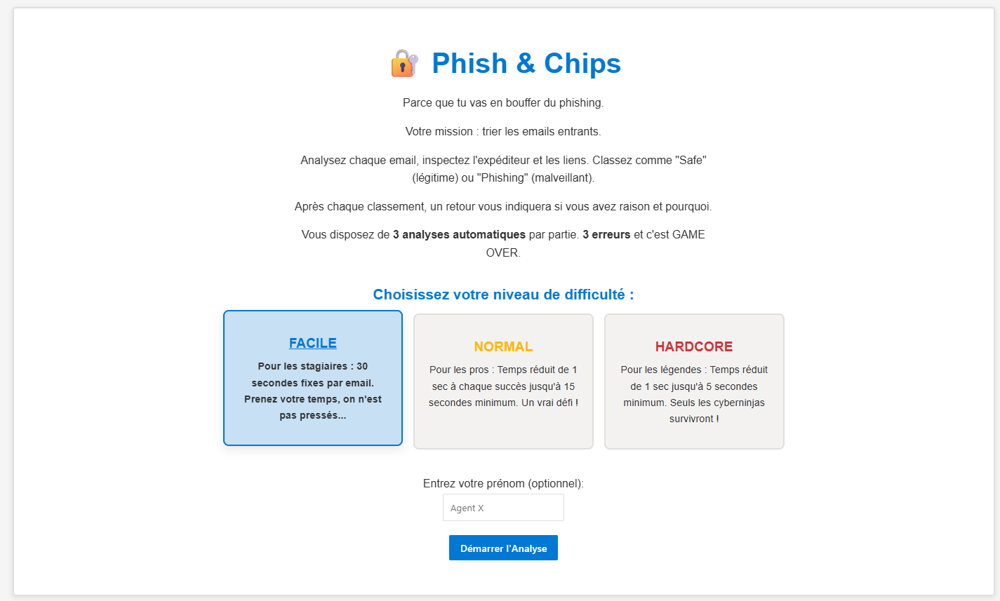
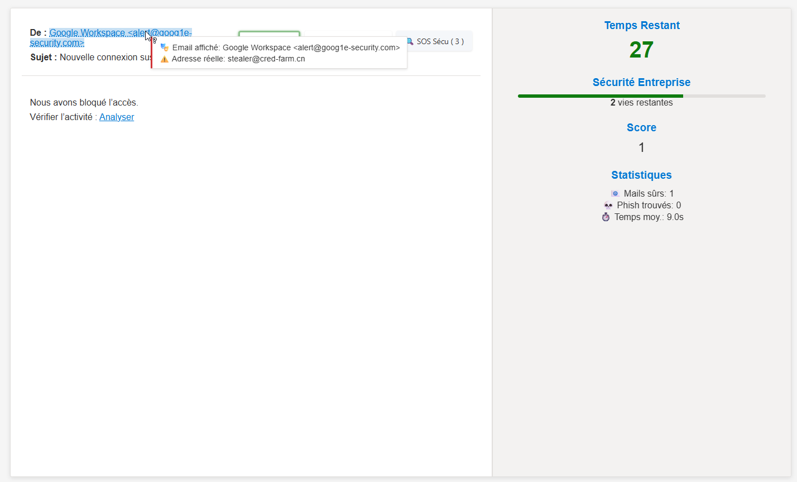
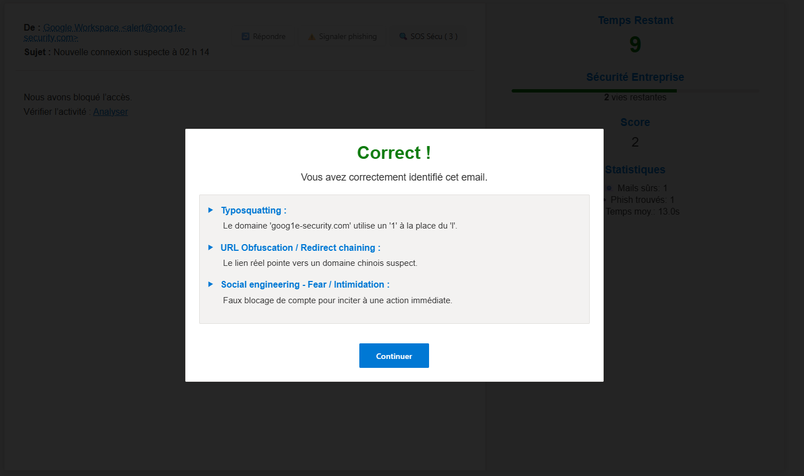

# 🔐 Phish & Chips – Parce que tu vas en bouffer du phishing.

Affûtez vos moustaches de détective anti-phishing et devenez le Sherlock Holmes du spam (les frites sont virtuelles, désolé) !

## 📋 Description

Bienvenue chez **Phish & Chips**, le fast-food de la cybersécurité où le plat du jour, c'est du phishing ! Votre mission, si vous l'acceptez (et vous n'avez pas vraiment le choix, c'est un jeu) : devenir un pro du tri d'emails. Démasquez les arnaques sournoises, protégez les messages innocents des griffes des cyber-vilains, et faites-le avec style (ou en pyjama, on ne juge pas).

Choisissez votre niveau de difficulté : de 'Stagiaire en sueur' à 'Cyber-Ninja vétéran qui a tout vu'. Chaque bonne réponse vous rapproche de la gloire éternelle (et d'un meilleur score). En cas d'erreur?!! Non vous ne voulez pas le savoir. Mais pas de panique, chaque feedback est une pépite de sagesse pour ne plus jamais vous faire avoir par un prince nigérian en détresse financière.

## 🖼️ Aperçu du jeu

Voici quelques captures d'écran pour illustrer l'interface du jeu :

*Page d'accueil de Phish & Chips*

*Affichage d'un email à analyser*

*Feedback après l'analyse d'un email*

## 🎮 Fonctionnalités

- **Interface plus vraie que nature** (ou presque) : On se croirait dans sa boîte mail. 
- **Trois niveaux de souffrance... euh, de difficulté** : Facile (pour tremper l'orteil sans se noyer), Normal (ça commence à picoter sérieusement), et Hardcore (préparez le café, les mouchoirs, et peut-être un psychologue).
- **Un score qui fait frémir (ou pleurer)** : Grimpez les échelons, de 'Bleu Bité du Web' à 'Maître Zen de l'Anti-Phishing', et frimez devant vos amis (ou votre chat).
- **Feedback qui claque (et qui éduque)** : Notre agent Sécu, un brin sardonique mais toujours pédagogue, vous dit tout, sans langue de bois mais avec des images (et parfois des blagues de papa).
- **Devenez accro aux stats (c'est légal, promis)** : Combien de méchants mails démasqués ? Quel est votre temps de réaction de super-héros ? Des chiffres pour briller en société !
- **Le Joker "SOS Sécu"** : 3 appels à un ami (virtuel, un peu bourru, mais efficace) par partie. Utilisez-les sagement, jeune padawan, la Force est limitée.

## 🛠️ Structure du Projet

### Fichiers Principaux

- **phishing.html** : Structure HTML du jeu
- **style.css** : Styles et mise en page
- **script.js** : Logique du jeu et interactions
- **emails.js** : Base de données des emails (légitimes et phishing)
- **secu.png** : Image de l'agent de sécurité qui fournit le feedback
- **help.html** : Page d'aide et d'instructions
- **OnePageVersion/phishing-onepage.html** : Version complète du jeu en un seul fichier HTML avec image en base64 (3.3Mo).
- **OnePageVersion/phishing-onepage-light.html** : Version complète du jeu en un seul fichier HTML sans image donc plus légère (213Ko).
- **prompt.txt** : Prompt pour générer de nouveaux scénarios d'emails

### Dossiers

- **OnePageVersion/** : Versions du jeu en une seule page HTML :
  - **phishing-onepage.html** : Version complète avec l'image de l'agent de sécurité intégrée en base64
  - **phishing-onepage-light.html** : Version légère sans l'image de l'agent de sécurité pour un fichier plus petit
- **SupabaseVersion/** : Version avec stockage des scores sur Supabase (en développement)

## 📧 Génération d'Emails

Envie de jouer les scénaristes de l'arnaque (pour la bonne cause, bien sûr !) ? Le fichier `prompt.txt` est votre grimoire secret. Donnez-le à manger à une IA sympa, et hop, de nouveaux pièges diaboliques (ou des emails innocents, faut varier les plaisirs) pour peupler `emails.js`. Et qui sait, votre création deviendra peut-être le cauchemar (ou le fou rire) du prochain joueur !

Le prompt est super précis, il demande même la couleur des chaussettes de l'expéditeur :
- Infos d'expéditeur (affichées et réelles)
- Sujet qui claque (ou qui pue l'arnaque à des kilomètres) et corps du message (où le diable est souvent dans les détails... et les fautes d'orthographe)
- Type : Phishing démoniaque ou Ange gardien légitime ? Faites vos jeux !
- Indices : les miettes de pain pour retrouver le chemin de la vérité (ou du précipice)
- Techniques de Sioux : la panoplie du parfait petit arnaqueur numérique (pour mieux les contrer, évidemment).

## 🚀 Évolutions Prévues

### Version One Page : Le jeu à emporter partout, même aux toilettes !
Plus besoin de jongler avec une brouette de fichiers ! Un seul HTML pour les gouverner tous. Parfait pour partager votre nouveau jeu préféré avec mamie Georgette (attention à la crise cardiaque), votre boss (pour lui prouver que vous êtes un AS de la cyber), ou même le faire tourner sur un grille-pain connecté (on n'a pas testé, mais si vous y arrivez, envoyez une photo !).

### Version Supabase : La compétition entre en jeu (et ça va saigner... virtuellement) !
Bientôt, quand on aura soudoyé assez de hamsters pour faire tourner les serveurs, préparez-vous à :
- Voir votre nom en lettres de feu (ou juste en gras, c'est moins cher) en haut du classement.
- Défier vos collègues pour savoir qui est le vrai boss de l'anti-phishing (et gagner le droit de choisir le café pendant une semaine).
- Analyser vos stats comme un profiler du FBI pour devenir une machine imbattable (ou juste pour voir où vous vous êtes lamentablement planté).
- Peut-être même des badges et des succès, si on trouve des dessins rigolos et pas trop chers.

## 🔧 Installation et Utilisation

1. **Récupérez le trésor (sans vous faire hameçonner en chemin)** : Tapez `git clone https://github.com/ZA512/PhishingGame.git` dans votre terminal préféré. Si vous ne savez pas ce qu'est un terminal, demandez à votre canard en plastique, il sait peut-être, ou cherchez sur Google, c'est plein de gens sympas qui expliquent des trucs.
2. **Double-cliquez comme si votre vie (numérique) en dépendait** : Trouvez le fichier `phishing.html` (ou une des versions OnePage si vous êtes du genre minimaliste) et ouvrez-le avec votre navigateur web favori.
3. **Sauvez le monde (virtuel), un email bidon à la fois** : Cliquez sur "Démarrer l'Analyse" et que la chasse aux malandrins du web commence !

C'est tout ! Pas besoin d'invoquer des démons informatiques, de sacrifier un poulet ou d'installer 150 paquets mystérieux. Votre navigateur suffit. Si ça c'est pas de la magie moderne !

---

# 🔐 Phish & Chips – Because you're gonna get a lot of phishing.

Sharpen your anti-phishing detective 'stache and become the Sherlock Holmes of spam (sorry, the chips are virtual)!

## 📋 Description

Welcome to **Phish & Chips**, the cybersecurity fast-food joint where today's special is... phishing! Your mission, should you choose to accept it (and you don't really have a choice, it's a game): become an email-sorting guru. Unmask sneaky scams, shield innocent messages from the clutches of cyber-villains, and do it with style (or in your PJs, no judgment here).

Pick your difficulty level: from 'Sweaty Intern' to 'Seen-it-all Cyber Ninja.' Every right answer gets you closer to eternal glory (and a better score). Make a mistake?!! You *really* don't want to know. But don't panic, every piece of feedback is a nugget of wisdom to ensure you're never again fooled by a financially distressed Nigerian prince.

## 🎮 Features

- **An interface truer than life** (almost): Feels just like your inbox.
- **Three levels of suffering... er, difficulty**: Easy (dip your toe in without drowning), Normal (it's starting to tingle seriously), and Hardcore (get the coffee, tissues, and maybe a therapist ready).
- **A score that'll make you shiver (or cry)**: Climb the ranks from 'Web Newbie' to 'Anti-Phishing Zen Master,' and show off to your friends (or your cat).
- **Feedback that slaps (and educates)**: Our Security Agent, a tad sarcastic but always a teacher, tells you everything, straight up, with pictures (and sometimes dad jokes).
- **Get hooked on stats (it's legal, we swear)**: How many baddie emails unmasked? What's your superhero reaction time? Numbers to make you shine at parties!
- **The "Security SOS" Joker**: 3 phone-a-friends (virtual, a bit grumpy, but effective) per game. Use them wisely, young padawan, the Force is limited.

## 🛠️ Project Structure

### Main Files

- **phishing.html**: HTML structure of the game
- **style.css**: Styles and layout
- **script.js**: Game logic and interactions
- **emails.js**: Email database (legitimate and phishing)
- **secu.png**: Image of the security agent providing feedback
- **help.html**: Help and instructions page
- **OnePageVersion/phishing-onepage.html**: Complete game version in a single HTML file with base64 embedded image (3.3MB).
- **OnePageVersion/phishing-onepage-light.html**: Complete game version in a single HTML file, lighter version without the image (213KB).
- **prompt.txt**: Prompt to generate new email scenarios

### Folders

- **OnePageVersion/**: Single-page HTML versions of the game:
  - **phishing-onepage.html**: Complete version with the security agent image embedded in base64
  - **phishing-onepage-light.html**: Lightweight version without the security agent image for a smaller file size
- **SupabaseVersion/**: Version with score storage on Supabase (in development)

## 📧 Email Generation

Fancy playing scam screenwriter (for a good cause, of course!)? The `prompt.txt` file is your secret spellbook. Feed it to a friendly AI, and poof, new diabolical traps (or innocent emails, gotta mix it up) to populate `emails.js`. And who knows, your creation might become the next player's nightmare (or laugh riot)!

The prompt is super specific, it even asks for the sender's sock color:
- Sender info (displayed and real)
- A subject line that pops (or stinks of a scam from a mile away) and a message body (where the devil is often in the details... and the typos)
- Type: Demonic phishing or legitimate guardian angel? Place your bets!
- Clues: breadcrumbs to find the path to truth (or the abyss)
- Cunning Tricks: the toolkit of the perfect little digital con artist (the better to thwart them, naturally).

## 🚀 Planned Developments

### One Page Version: The game to take everywhere, even to the loo!
No more juggling a wheelbarrow of files! One HTML to rule them all. Perfect for sharing your new favorite game with Grandma Agnes (watch out for heart attacks with those tricky emails), your boss (to prove you're a cyber-whiz), or even running it on a smart toaster (we haven't tried, but if you do, send pics!).

### Supabase Version: The competition begins (and there will be blood... virtually)!
Soon, when we've bribed enough hamsters to power the servers, get ready to:
- See your name in lights (or just bold, it's cheaper) at the top of the leaderboard.
- Challenge your colleagues to see who's the real anti-phishing boss (and win coffee-choosing rights for a week).
- Analyze your stats like an FBI profiler to become an unbeatable machine (or just to see where you epically failed).
- Maybe even badges and achievements, if we find some funny, not-too-expensive designs.

## 🔧 Installation and Usage

1. **Grab the treasure (without getting hooked yourself)**: Type `git clone https://github.com/ZA512/PhishingGame.git` into your favorite terminal. If you don't know what a terminal is, ask your rubber ducky, it might know, or Google it – the internet is full of nice people explaining stuff.
2. **Double-click like your (digital) life depends on it**: Find the `phishing.html` file (or one of the OnePage versions if you're a minimalist) and open it with your favorite web browser.
3. **Save the (virtual) world, one bogus email at a time**: Click "Start Analysis" and let the hunt for web scoundrels begin!

That's it! No need to summon IT demons, sacrifice a chicken, or install 150 mysterious packages. Your browser is all you need. If that's not modern magic, what is?

